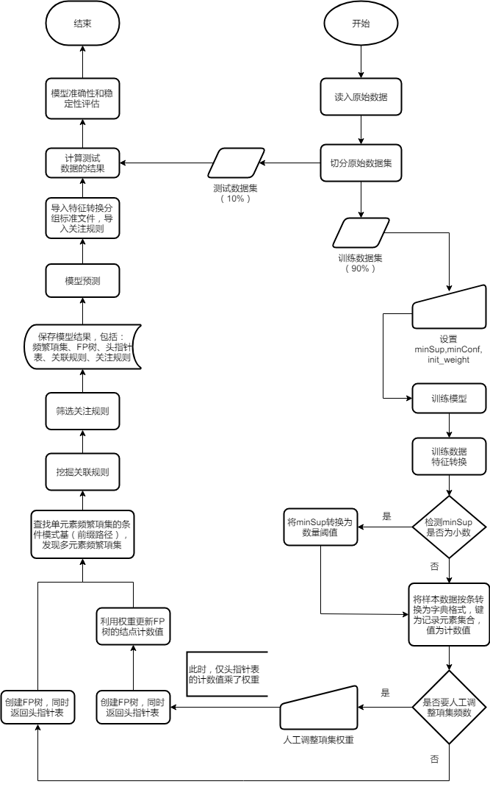

# expected-attention-model-of-enterprises
企业预期关注度模型 ，采用FP-Growth关联算法分析可能导致企业产生不同风险等级的关键特征及其组合

|文件名|描述|
|-|-|
|demo演示指标.xlsx|指标中英文名字典,及算法数据源介绍|
|datasets.csv|构造的字段数据|
|features.csv|构造的样本数据|
|features_grouped.xlsx|输出的指标分组样本数据|
|features_group_name.xlsx|输出的指标分组标准|
|features_group_name_adjusted.xlsx|需手动调整分组权重, 后被程序调用|
|rules.xlsx|模型输出结果文件, 包含 频繁项集/各组合支持度/关联规则/关注规则|
|genereate_datasets_features.py|用于生成样本数据,计算指标|
|apriori.py|apriori关联算法,生成rules.xlsx文件|
|fpGrowth.py|FP-growth关联算法,生成rules.xlsx文件|

### 关联分析数据处理流程图

